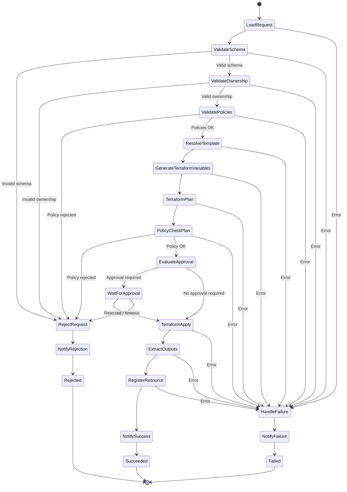

# State machine — diagram & ASL design notes

## State diagram

## Where the ASL differs from the task's first draft (and why)

The base draft in the task is a good skeleton but has data-flow bugs. The
implemented [`provisioning.asl.json`](../infra/terraform/statemachine/provisioning.asl.json)
fixes them:

1. **`ResultPath` on every state.** The draft's Tasks would overwrite the whole
   state with each Lambda's output, so a `Choice` reading `$.validation.schema_valid`
   right after a Task that replaced `$` couldn't work, and `LoadRequest`'s
   `request` would be lost before `TerraformPlan`. Each state now writes its
   result to a dedicated path (`$.schema`, `$.ownership`, `$.policies`,
   `$.template`, `$.terraform`, `$.policy_check`, `$.approval`, …) so nothing is
   clobbered and the whole accumulated context is available downstream.

2. **`lambda:invoke` + `ResultSelector`.** Using the `arn:aws:states:::lambda:invoke`
   integration lets us shape each Lambda's `$.Payload` into a small, explicit
   fragment, keeping the execution state clean instead of carrying Lambda
   metadata around.

3. **Separate paths for schema / ownership / policies.** The draft merged all
   three validations under `$.validation`, which collide. They are split so each
   `Choice` reads an unambiguous boolean.

4. **Human approval uses the callback pattern** (`lambda:invoke.waitForTaskToken`),
   which is the correct way to pause a Standard workflow for an external
   decision, instead of a plain Task that "waits". The Lambda persists the task
   token on the request row; an external approver resumes with
   `SendTaskSuccess`/`SendTaskFailure`. Demo mode auto-approves.

5. **`Rejected` is a `Succeed` state, not `Fail`.** A business rejection
   (bad schema/ownership/policy, or approval denied) is a normal terminal
   outcome — the execution should not be marked as a failed execution. Only
   genuine system errors go through `HandleFailure → NotifyFailure → Failed`
   (a `Fail` state). This keeps Step Functions failure metrics/alarms meaningful.

6. **Retries and timeouts.**
   - All Lambda Tasks retry transient Lambda service errors
     (`Lambda.ServiceException`, `Lambda.TooManyRequestsException`, …) with
     exponential backoff.
   - `TerraformPlan` retries `States.TaskFailed` up to 2× (idempotent);
     `TerraformApply` retries at most once and is treated as possibly
     `INCONSISTENT` on failure (a partial apply may have created resources).
   - `WaitForApproval` has a 24h `TimeoutSeconds`; on timeout it routes to
     `RejectRequest`. The whole state machine has a 48h top-level timeout.
   - Every Task has a `Catch` for `States.ALL` routing to `HandleFailure`, so an
     uncaught error never silently fails the whole execution.

## Terraform plan/apply via CodeBuild `.sync`

`TerraformPlan` and `TerraformApply` use `arn:aws:states:::codebuild:startBuild.sync`,
so the workflow blocks until the build finishes. The buildspecs
([plan](../infra/buildspecs/terraform-plan.yml) /
[apply](../infra/buildspecs/terraform-apply.yml)) clone the templates repo,
`git checkout` the **immutable `commit_sha`**, select the `module_path`, wire the
S3+DynamoDB backend at the request's `state_key`, and exchange artifacts
(`terraform.tfvars.json`, `tfplan`, `tfplan.json`, `outputs.json`) through the
artifacts bucket keyed by `request_id`. Apply consumes the exact plan that was
policy-checked and approved.
